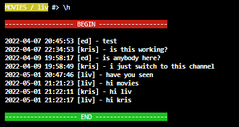

# INSTRUKCJA

W pierwszej kolejności należy uruchomić [Server](https://github.com/magikabdul/sages-homework-chat/tree/main/console-version/server)
domyślnie nasłuchuje na porcie `9500`. 
Jeżeli chcemy wybrać inny port, to jako parametr `port:<numer portu>`

Na potrzeby sprawdzenia działania aplikacji, możliwości konwersacji grupowej, jak i w poszczególnych kanałach
jest wczytywana domyślna konfiguracja.

Oprócz kanału głównego mamy dwa kanały prywatne:
- games
- movies

"Logowanie" w aplikacji polega na wpisaniu z konsoli dowolnego nick-a. 

Następnie użytkownik może rozmawiać w głównym kanale.

Przełączenie do odpowiedniego kanału następuje po podaniu odpowiedniego polecenia `\c<nazwa kanału>` np. `\cgames`.
Można tylko przełączać się na istniejące kanały (games, movies). 

Powrót to głównego kanału następuje po wpisaniu `\c`

Do kanału może się zalogować tylko użytkownik, który ma do niego uprawnienia. Na potrzeby testów do poszczególnych kanałów
zostali przypisani użytkownicy według poniższej listy.

### games
- kris
- tom
- alice

### movies
- kris
- ed
- thomas
- liv

Serwer na bieżąco zapisuje historię rozmów. Użytkownik może pobrać historię danego kanału za pomocą polecenia `\h`.
Historię można pobrać tylko dla kanału, na którym znajduje się użytkownik. Nie ma zatem możliwości pobranie historii kanału,
do którego użytkownik nie może się zalogować.

Serwer pozwala na przesyłanie plików pomiędzy użytkownikami w obrębie kanału. Przesłanie pliku jest możliwe tylko pomiędzy
zalogowanymi użytkownikami.

Wskazanie nieistniejącego odbiorcy pliku powoduje wyświetlenie komunikatu o błędzie.

Przesłanie pliku dokonujemy za pomocą polecenia `\f<nazwa-pliku>-<odbiorca>` np. `\fa.jpg-tom`.

Po zainicjowaniu wysłania pliku, zdalna strona musi potwierdzić odbiór, wydając polecenie `\r`.

Zakończenie pracy następuje po wydaniu polecenia `\q`. Działa na dowolnym poziomie chat-u.

Przykład działania chatu, różnych osób na różnych kanałach

