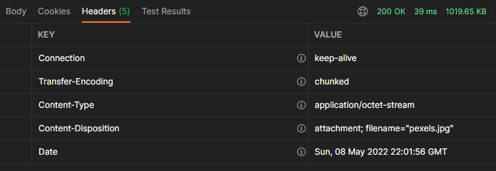

# INSTRUKCJA

Główny element aplikacji to aplikacja serwerowa, którą należy wgrać na serwer aplikacyjny. Aplikacja była uruchamiana
na serwerze JBoss v. 26.1.0.Final. 
Aplikacja korzysta z bazy danych, której sterownik oraz konfiguracja znajdują się na serwerze aplikacyjnym.

Root aplikacji - `chat`

## REJESTRACJA
W celu korzystania z aplikacji konieczne jest zarejestrowanie użytkownika. 
Nałożone są minimalne wymagania:
- login minimalna długość 3 znaki, maksymalna 50
- hasło minimalna długość 5 znaków

### `POST` `http://localhost:8080/chat/users/register`

Przy próbie utworzenia konta, dla którego nick już istnieje jest rzucany wyjątek i otrzymujemy błąd `User already exists`

Poprawnie założone konto zwraca w nagłówku `Location` i kod odpowiedzi `201`

## LOGOWANIE

### `POST` `http://localhost:8080/chat/users/login`

Podanie błędnych danych logowania zwraca kod odpowiedzi `404`

Poprawne logowanie zwraca kod `200` oraz `token`, który jest używany do autoryzacji i jest wysyłany w nagłówku

## KANAŁY CHATU

Domyślanie nowo zalogowany użytkownik jest przypisany do kanału `GENERAL`
### PRZEŁĄCZENIE UŻYTKOWNIKA NA INNY KANAŁ
Wymagane jest podanie tokena w nagłówku.

### `GET` `http://localhost:8080/chat/channels/change/<nazwa kanału>`

Jeżeli kanał istnieje dostajemy kod `202`

Jeżeli kanał nie istnieje dostajemy kod `400`

### UTWORZENIE NOWEGO KANAŁU
Wymagane jest podanie tokena w nagłówku.

### `POST` `http://localhost:8080/chat/channels/`

Jeżeli kanał istnieje, to dostajemy kod `400`

Jeżeli kanał nie istniał, to dostajemy kod `201`

### PUBLIKOWANIE WIADOMOŚCI
Wymagane jest podanie tokena w nagłówku.
Wiadomość jest przyporządkowana do kanału, na którym znajduje się użytkownik

### `POST` `http://localhost:8080/chat/channels/messages`

W odpowiedzi otrzymujemy kod `200`

### POBIERANIE HISTORII KANAŁU
Wymagane jest podanie tokena w nagłówku.
Historia jest wyświetlana tylko dla kanału, na którym obecnie znajduje się użytkownik.
Pobranie historii innego kanału wymaga przełączenia się na ten kanał.

### `GET` `http://localhost:8080/chat/channels/history`

W odpowiedzi dostajemy kod `200` oraz tablicę obiektów lub pustą tablicę, kiedy nie było żadnych rozmów na kanale.

### WYSZUKIWANIE WIADOMOŚCI PO ID
Wymagane jest podanie tokena w nagłówku.

### `GET` `http://localhost:8080/chat/channels/messages/<id>`

Jeżeli wiadomość istnieje dostajemy kod `200`

Jeżeli wiadomość nie została znaleziona dostajemy kod `404`

### WYSZUKIWANIE OSTATNIEJ WIADOMOŚCI NA KANALE
Wymagane jest podanie tokena w nagłówku.

_Obecnie nie działa mi rozgłaszanie wiadomości z wykorzystanie JMS, dlatego dla potrzeby uruchomienia klienta, została w nim zaimplementowana funkacja odpytywania serwera o ostatnią wiadomość na kanale_

### `GET` `http://localhost:8080/chat/channels/messages`

W odpowiedzi otrzymujemy kod `200`

### WYSYŁANIE PLIKU NA SERWER

### `POST` `http://localhost:8080/chat/channels/files/upload`

Wymagane jest podanie tokena w nagłówku.
Korzystamy z `form-data`, gdzie konieczne jest podanie dwóch parametrów:
- `file` - plik do wgrania
- `fileName` - nazwa, pod którą zostanie zapisany na serwerze

W odpowiedzi otrzymujemy kod `200`

Domyślnie plik jest zapisywany w głównym katalogu na dysku `D`

### POBIERANIE PLIKU Z SERWERA
Wymagane jest podanie tokena w nagłówku.
Nazwę pliku podajemy jako parametr w ścieżce w zapytaniu pod kluczem `fileName`

### `GET` `http://localhost:8080/chat/channels/files/download?fileName=<nazwa-pliku>`

W odpowiedzi otrzymujemy kod `200`. Informacje o pliku znajduję się w nagłówku `Content-Disposition`

# APLIKACJA KLIENCKA

Do współpracy z aplikacją serwerową została napisana aplikacja kliencka pracująca w konsoli.

`java -jar target/rest-client-1.0-SNAPSHOT.jar`

Po uruchomieniu pojawia się następujący widok

### TWORZENIE KONTA

### LOGOWANIE

Po pomyślnym zalogowaniu wyświetla się prompt z nazwą kanału i loginem użytkownika

### WYŚWIETLANIE HISTORII

### PUBLIKOWANIE WIADOMOŚCI

Konsola użytkownika `qwe`

Konsola użytkownika `asd`

### ZAKOŃCZENIE PRACY

